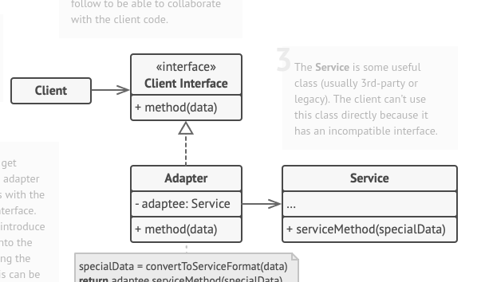
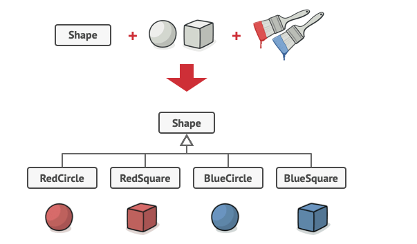
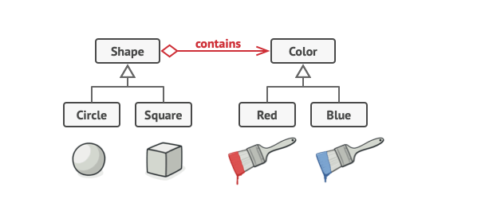
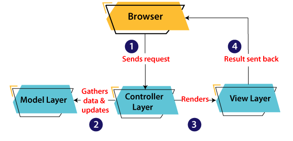

# Design Patterns

Design patterns are template solutions to common problems that developers encounter. They provide complete concepts which developers use to organize theyre code. Design patterns are not attached to a specific language and in general are not ready to be directly transformed into code. They are general concepts which can be applied to a specific problem in any programming lanuage. 

Some design patterns are specific for functional programming, however in java we focus on those which are related to OOP (Object Oriented Programming). These design patterns can be classified into 3 seperate categories. 

Creational design patterns are templates which involve object instantiation. Hence they solve problems that have to do with object creation or using the `new` keyword in java.

Structural design patterns are templates which involve object structure and relationships. They target problems that have to do with how the objects are related to each other via inheritance or composition and aggregation.

Behavioural design patterns are templates which involve object communication. These concepts target how objects communicate with each other and how to reduce code redundancy and ensure the saftey of the object of the code.
    
    Note: Design patterns are ussually accompanied with a UML (Universal Modelling 
    Language) diagram to help illustrate the idea of the program

## Creational Design Patterns 
### Factory Pattern
Problem: 
Some objects are platform/input dependant and based on the type of platform or input the object instantiated might vary. It would be redudundant to create a bunch of if statements checking the platform whenver an object of that type is needed.

Solution:
Create a factory class/object which its sole job is to return these objects based on the input and/or the platform which the platform is running on.

UML:

### Abstract Factory Pattern
Problem: 
In the previous section the object itself was a dependant. However the same could be said about the factory object. Hence what if the factory producing the object was dependant on a specific input ? It would be redundant to make two entirley seperate classes since that would introduce alot of redundant code.

Solution:
Have the factories extend an abstract factory class. The constructor of the class would determine which factory should be created. This ensures that the correct factory is generated and thus the correct object is obtained

### Singelton Pattern
Problem:
In some programs is it important to ensure that only a single object is instantiated per some unit. For example only a single context per compiler class. Hence it would be problematic if a statement had two contexts. This can be done via code, but in larger enviroments the objects constructor may be called twice. The question is how can that object ensure that only one of it exists ?

Solution:
Implement a singleton pattern. Either instatiate the object are loading time (Early instantiation) or when the object is needed (Lazy instantiation). Regardless ensure the following is applied:

- Constructer is private.
- Members are static (They belong to the class)
- Instantiate the object within the class its self (as a private static member)
- A single factory method to instantiate the object which checks if the object has previously been instantiated or not.

### Prototype Pattern
Problem: Creating new objects is more expensive than cloning new objects. 
Solution: Instead of creating a new object, simply clone an existing one.

To ensure this is possible, simple make sure that the object implements java's clonable interface.
### Builder Pattern
Problem: Some objects have multiple complex stages to create. This is a common problem that developers encounter when reading from a file. For example representing information as a tree object requires iterating over the data in the file. 

Solution: Create a builder class to handle all the stages and have it simply return the intended object. Pretty much all parsers are considered builder classes which return an AST (Abstract Syntax Tree). The simplest two examples of this are the tree made in the [compiler](https://github.com/SsagatroNN/JaffaUCompiler/) and the [xml-parsers](https://github.com/SsagatroNN/XML-Parsing).
## Structural Design Patterns
Note that many structural patterns may have the same structure where inhertience is substituted by aggregation of composition, but its important to note that each pattern represents the structure with a different intent. This is important since design patterns are merley concepts to solve specific problems. These differences in intent will eventually be reflected in differences in code. Hence an composite and a decorator pattern both envelope classes within each other but when implemented they wil not have the same code.
### Adapter Design Pattern
Problem: Two classes are related to each other but cannot inherit from each other due to incompatible interfaces. This sounds abstract but simply put, a client may want to use class A using a specific interface which the class does not have.

Solution: Create a class which implements the targeted interface, but inherits the adaptee class. The adapter class use the inhertied functions to implement an intefrace which the client has requested.

UML:

### Bridge Design Pattern
Problem: Using inheritence to model some characteristics can be problematic. One major problem is that in some cases it may introduce exponential growth of subclasses. Take for example the image below:

 

Suppose you were to add another color, you have to add 2 more sub classes. And if another shape was added, then u would need 3 more subclases. It is clear that modelling the color this method would become problematic.

Solution: 
Use composition and aggregation instead of inheritence. The reason for the name `Bridge` is that the UML represents a bridge.

### Composite Design Pattern
Problem: The objects used create a recursive tree pattern. How should these be represented in order to allow for easy calculations to be implemented on the object? An easy example is to imagine a set of russian dolls. The same object can be contain another object of its own instance until you arrive at leaf nodes. 

Solution: Use a tree like structure and implement recursive methods in the class to allow the methods to traverse the entire tree and operate on it efficiently.

### Decorator Design Pattern
Problem: Suppose an object has limited functionality during laod time. It can only communicate is lanuage A. Suppose the clients wants to be able to communicate using language B. There happens to be another object which can speak lanuage B. So rather than rewriting lanugage be in object A, the programmer simply makes object A extend object B. This approach seems good, however what if the client now wants to add a 3rd language ?. Now the client might ask for combinations of these languages ? This could clearly become problematic over time.

Solution: Use a decorator pattern which encapsulated objects within its self during or before runtime to add functionality to an object. Hence you can encapsulate lanuage A and B into one object and use that, if a 3rd language was added, it could also be added to the decorator class without breaking any code and so on.

### Facade Design Pattern
Problem: A complex system has many classes with many different interfaces which perform complex iterations at any point in time. It is difficult for the client or user to adjust or use all the objects in the system since they will have to adjust to each interface accordingly. 

Solution: Implement a facade interface which all related classes in the system should implement (follow). This hides the compelxity of the system from the user and allows for ease of access.

### Flyweight Design Pattern

This pattern is not commonly used since its application is quite specific but it simply says to use already existing objects rather than making new ones. These already exixsting objects need to be already out of the scope of the program however they still exist in memory.

### Proxy Design Pattern
Problem: A common problem is Authorization limits to a specific object. How would one be able to check what/who is trying to access a specfic object and redirect them accordingly ?

Solution: Proxy pattern does just that. It is commonly used in web development and its quite useful pattern to implement for authoraritive reasons. 

There are 4 types of proxies:

Virtual proxy:  Is a caching proxy. It checks whether incoming reqeusts are accessing data that has already been pulled from a database before (Thus it has a reference/copy of them) or if it needs to query the database.

Protective proxy: Used to check authority before forwarding/ redirecting request.

Remote proxy: This is the web proxy which is used as an interface for web services and/or a REST API.

Smart proxy: (Not common) Provides additional layer of security based on interposing specific actions. (Many incorrect requests from the same IP for example might trigger this proxy) since many discovery tools use wordlists to determine api endpoints.
##  Behavioural Design Patterns
### Chain of Responsibility Design Pattern
Problem: 
Many objects need to go through a rigourous checking proccess before being allowed to access some piece of data. It is possible to implement the entire checking proccess in one large chunk of code however that soon becomes chaotic and diffifcult to debug. 

Solution: Implement Chain of responsibility template using handlers. Instead checking all at once. You create handler classes, each once with a specific task (handle). At each stage, the handler either passes the object onto the next handler, or redirects it to somehwere else/ throws an error.

### Command Design Pattern
Problem: Suppose your deisnging a UI and multiple buttons have the same or similiar functionality. What should each button send/ create when its clicked. ? or should u just hard code what every button should do in each press ?.

Solution: Use a command pattern. The command pattern encapsulates a request generated by an invoker and send the command object to propogate through the system. 

The command can be an interface which multiple sub commands implement. (That way all commands have a uniform interface).

The command pattern has a few vital important features. 

A client creates a concrete command and specifies the reciever. The command created waits for the invoker class to invoke a request and sends the command object (with the encapsulated request) to the reciever. The reciever performs the operation which the command contains.

### Interperter Design Pattern
This design pattern is not very useful outside the context of grammer but the general concept is that it runs over an AST which has been parsed based on a set of grammar rules. The interperter simply `interperts` or evaluates each node in the tree accordingly. Similiar to how the JVM interperts the byte code generated by the java compiler.

(Python uses an interperter to run code insteaf of compiling into an executable)
### Iterator  Design Pattern
Problem: Many objects are effectivley a collection of objects. Suppose an O(N) algorithm needs to iterate over all N items in the collection. How can this be done efficiently ? 

Solution: The class should implement the iterator interface found in java and should return an iterator object which allows sequential access of the objects in the collection. Whether that access is unordered or ordered depends on the type of collection itself. (Set is unordered, but list is ordered).

### Mediator Design Pattern
Problem: An complex system requires methods and members of multiple objects. They interact with each other in a delocalized manner meaning that the members accessed dont all meet at a single point. This type of code is difficult to develope since any modification to a single class might affect how the other objects are interacting with it.

Solution: Use a mediator object. This class is responsible for gathering the data from all other classes in a sequential manner such that all previos oprations end at the mediator class. The mediator class then returns the resultant/ wanted object. An example of this is pulling up information from lower nodes in an AST tree in order to write some speicifc assembly instructions in the [compiler](https://github.com/SsagatroNN/JaffaUCompiler/).
### Memento Design Pattern
Problem: How do u store a snapshot/ copy of an object and move back and forth between the older snapshot stored and the current state of the object ? (Simply put how do u implement CTRL + z).

Note that moving between the snapshot and the original object should be done with caution as not to break encapsulation.

Solution: The memento pattern introduces a solution. An originator object creates a snap shot with public meta data about the originator while keeping the rest of the originators data private. A memento object is allowed to fetch and return the meta deta about the originator. It is allowed to instruct the snap shot to modify the originator but it does not have access to setting or getting the snapshots or the originators content data. External code, i.e caretaker code can ask the momento for meta data or can instruct the originator to generate a new snapshot. Mementos is how CTRL+z is implemented pretty much everywhere.
### Observer Design Pattern
Problem: Suppose an object is a dependency. If the dependency is modified, all dependants must refresh and reapply the modified dependency. This behaviour cannot be implemented without an observer.

Solution: Observer pattern is a one-to-one dependency watcher object which keeps track of the state of a dependency. If the dependency is modified, then it notifies all dependents (objects that depend on it) to refresh.
### State Design Pattern
Problem: Many handwritten designs are dependant on FSM's (Finite State Machines). Overtime a robust pattern was generated to be able to implement code which is constructed using an FSM.

Solution: A state interface is created and all states implement it. A controller calls the states and based in the inputs given the controller a specific state object is used. Each state would have a different concrete implementation since each state has a different job.
### Strategy Design Pattern
Problem: Suppose that a data model can be operated on by a set of algorithms. Adding the algorithms one at a time to the base class introduces a load of unnessary bugs and debugging and it becomes difficult to debug the code. A simple example of this is implementing Dijkstra's Algorithm for a map for multiple vehicles (cars, walking and public transport).

Solution: Seperate the Algorithms into Strategy classes. Each class implementing the desired algorithm. A context class (which contains the data to be operated on) can call the desired strategy when needed. This decouples the algorithms from each other meaning that once the algorithm is working it can be decoupled from the main class as a strategy, hence reducing the time used for debugging.

## MVC Web Development Architecture

A common design pattern used for making web apps is MVC (Model View Controller) architecture. The design consists of 3 main aspects. The data model, the controller, and the view. Each model is a seperate class and has a specific task.

### Data Model
The data model contains all the data required for the webapp. It can be stored in a data base and accessed throught a data model class using the JDBC (Java DataBase Connector) API. This data should remain secure and can only be accessed through the data model class, which communicates only with the controller.
### Controller

The controller is in charge of the flow of the webapp. Its the class which contains the logic of the app and handles requests made by users.
### View

It is class which presents the information found in the data model. The data presented is accessed throught the controller. The view is also the responder to the requests hence once the data is written as HTML it can be sent over as a response.

A typical lifecycle for the architecture involves 4 stages.
- Request recieved by Controller
- Controller may request data from data model or simply does some logic
- Controller writes to the view what should be viewed on the webpage
- View model replies with the response.

