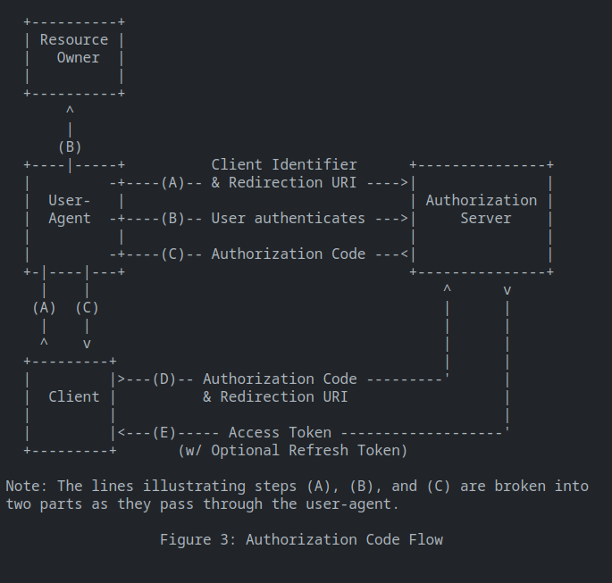

# Spring Details

This file describes certian details about the Spring/-boot Framework along with some details about the ORM Hibernate.

## Spring Security
### Password Storage

Spring security provides utility to store passwords safley in a database. Passwords cannot be stored as plain text as they are vulnerable to username and password dumps which can be done via SQL injections. Spring framework allows the user to store the passowrd with whatever degree of security is needed. For example, SPring securtiy provides a set of Password encoders to store the one-way hash of a password. The developer can still match the password input by the user during a login request by hasing the input and comparing it with the stored password. Note that the password is still susceptible to a Rainbow table attack. This can be prevented by adding salt to the hashed password, which is a series of random bytes. The salt is stored along side the password and is fetched when matching is done. This is currently the safest hash possible in Spring. However other alternative methods are possible. The main factor that should be taken into account when proccessing passwords is the computational cost is incurrs on the system. It should ideally take around 1 second to verify the password.

### CSRF

Cross Site Request Forgery (CSRF) is a type of attack that exploits the fact that requests might have cookies stored from other sites. This is generally dangerous as some cookies might contain sensitive information. The following [example](https://docs.spring.io/spring-security/reference/features/exploits/csrf.html) illustrates how the attack works and how it relies on the request from the enemie's site to be the same as the one from the victim site. This introduces two ways to solve the problem.

- Ensure that the enemy website will be different request by introducing some sort of token that it only available at the original message (Synchronizer Token)
- Use the SameSite Attribute when setting a cookie

Both solutions are valid however there are a few things to note. The Synchronizer Token cannot be stored as a cookie, otherwise you end up with the same scenario where the cookies are still being sent from the enemies website (and the token is being sent as well since its a cookie).

On the other hand using the SameSite attribute when setting a cookie might introduce some bugs. 
 
### Spring Headers

Spring ensures the saftey of the resources by using strict [HTTP response headers](https://docs.spring.io/spring-security/reference/features/exploits/headers.html) by default. If the defaults do not meet the requirments, they can be altered. The main sections of the response which can be altered are:

- Cache Control (default: no-cache, no-store, max-age=0, must-revalidate)
- Content Type Options
- HTTP Strict Transport Security
- X-Frame-Options (Default: DENY)
- X-XSS-Protection (Default: 0)

#### Cache Control

This is disabled by default to ensure that the client does not store any sensitive data. Caching may be enabled if the Application required it.

#### Content Type Options

This is mainly dependant on the resource being sent out. The content type might need change based on the payload. Historitcally browsers attempted to guess the type of the content via sniffing. However this introduced some vulnerabilities since a malicious user might send a payload which is a valid JS script while fitting a valid postscript payload. To prevent this Spring disables sniffing my default.

#### HTTP Strict Transport Security 

Spring allows for the use of HTTPS to prevent man in the middle attacks. This is done by encrypting requests with public keys held by the clients. The requests encrypted using the public key can only be decrypted using a private key that the server/ api has. Public keys are handed out to clients when they join/ request a resource.  This method is known as HTTP Public Key Pinning (HPKP). In addition, headers specific (such as Strict-Transport-Security) to HTTPS are injected into the response to prevent MITM attacks.

#### X-Frame-Options

This optin determines whether the website has access to the frame. In general it should not be granted access to the frame in order to prevent clickjacking attacks. clickjacking attacks are when a malicious user modified the css to show a misplaced button to trick you into clikcing something that you did not intend to click. 

In moderm browsers the website does not have access to the frame since the X-Frame-Options header is set to DENY;

#### X-XSS-Protection

This is a header used to prevent XSS attacks. To prevent this, the X-XSS-Protection is set to 0 as per the recommendation of OWASP.

#### Policies

Spring allows the user to set their own policies for headers. These include the content security policy (CSP), Referrer Policy, Feature Policy and Permissions Policy headers. These can be used in order to secure resources and prevent unauthorized access. Vitally, the CSP header is used to mitigate injection vulnerabilities. Although its not a fool proof solution, CSP reduces the number of vulnderabilities significantly. The headers specifiy sources which scripts can be loaded from. Attempting to load scripts for other sources will automatically be blocked. They will also report violations to the report-uri specificfied in the header.

### Integration

Spring Security is made to integrate easiliy with other frameworks and API's. A few examples are provided below.

#### Cryptography

Spring uses an Encryptors factory class which can be used to create all sorts of encrypters ranging from `byte[]` to `String` ecnoders. Another usefull class is the Key Generator class which creates keys that are used by encryptors. At a higher level, the user can also just use the Password encoder interface.

#### Spring Data and Concurrency

Spring data is used to fetch data from databases and interact with data models. Nameley, Spring data provides 3 main repositories which can be used to query from a database. These databases can be used with spring security (See book-quest repo).

Spring data is highly compatible with java's concurrency api, which allowed Spring security to run in parrallel with the application. This is vital since most security systems use filters to detect whether requests are authorized or not.

### Other features

Spring security contains alot more features which allow it to use other protocols and integrate with other applications. The Documentation mainly highlights springs capibility to integreate with servlet applications and Reactive applications.

## Hibernate and Java Persistence API (JPA)

The Jakarta Persistence API is a specification used to store/ persist data after the program has ended. This is mainly done using a database. Hence JPA acts as an adapter between SQL and POJO's created in java code.

JPA has two main components in charge of persisting data, the `EntityManagerFactory` and the `EntityManager`. They are in charge of dealing with Entity objects. Entities are considered objects which represent a table in a database. Each instance of an entity maps to a single row in the table. Requirments for entity objects are can be found in the [docs](https://docs.oracle.com/javaee/6/tutorial/doc/bnbqa.html).

Entities can map to one another using the `@OneToOne`, `@OneToMany` or `@ManyToMany` annotations. These relationships are usually described by an ER diagram, and can be directly applied to the POJO's entities.

An important attribute to set when it comes to Entities is the `jakarta.persistence.FetchType`. which specifies how they are fetched from the database. The fetch tyoe is either LAZY or EAGER. 

EAGER loading loads data with one heavy call that uses subqueries and joins. LAZY loading produces multiple sql queries in order to fetch the data. Eager loading as it sounds, puts a heavy load on the SQL server but recieves the entire data at once. Lazy loading is less stressfull on the sql server but may take longer to load the data. 

EAGER loading should be used when the data being fetched will be used often. For example, in the case of a many-to-one relationship, the one side should be fetched eagerly since it will probably be called many times since it is mapped to by many rows. On the other hand, the collection sideof the relationship can be fetched lazily. Data that is rarley used can also be fetched lazily.

JPA provides an in depth specificaiton of how to persist data. However it does not provide an implementation. This is where Hibernate comes in. Hibernate is an ORM (Object Relational Mapping) tool used to represent relational databases as POJO's. It is significantly heavier than using simple JDBC connectivity however it provides alot more functionality.e Java Persistence Query Langu

Hibernate is considered the inspiration behind JPA and includes a complete implementaiton of the specifications. Utilizng both a `SessionManager` and a `SessionManagerFactory` instead of an `EntityManager` and `EntityManagerFactory`.

Note that hibernate and JPA can be used independantly of the spring framework. They are tools for general use and are not specific to spring. That said, hibernate seems to be the top choice for data persistence and is used widley.

Generally speaking its a good option to choose hibernate when working on big projects with multiple relationships. However when creating a simple application, using JDBC along with SQL is a better option.

JPA and Hiberante also offer their own query languages. These langauges are higher level and use the entity names rather than the table names to perform their query. The query statements are compiled into SQL statements by hibernate during run time. Using HQL or JPQL makes it alot easier to query certain pieces of data. More information regarding HQL can be found in the [docs](https://docs.jboss.org/hibernate/core/3.3/reference/en/html/queryhql.html).

## OAUTH 2.0

Open Authentication 2.0 is a secure method of authenticating a user. The oauth protocol defines specifications and the structure of the application used. However it does not provide a solid implementation. The general architecture can be seen below.

  

The client is considered to be the application/program trying to gain access to the resource. The resource owner is the user themselves (They are trying to access a resource they own). The User-agent would be the browser in this scenario. The flow of the login is detailed below.

- (A) The user initiates the login sequence by requesting from the authorization servera code grant. In this step there are a few things that the specis enforce. The request sent is a form with a client id, state (random string), scope (The scope of their access), redirect_uri (where they are trying to redirect to) and a responce type which in most cases is "code". Hence they are expecting a reponse which contains code.

- (B) The Authorization server recieves the response and prompts the resource owner to either accept or deny the response.

- (C) Assuming the user accepts, the authorization server returns to the user agent a code-grant.

- (D) The client sends the code grant along with the redirect URI to the authorization server which responds to the client with the access Token and refresh token.

Note that the access token was never revealed to the user-agent. The access token remained in the client app. This is the main advantage of oauth 2, the access token never gets revealed to the user-agent and remains between the client app and the authorization server.

The client can then use the acccess token when communicating with the resource server. The authorization server and the resource server may be collapsed into one server if the application is relativley small. However in general they are two different servers.

